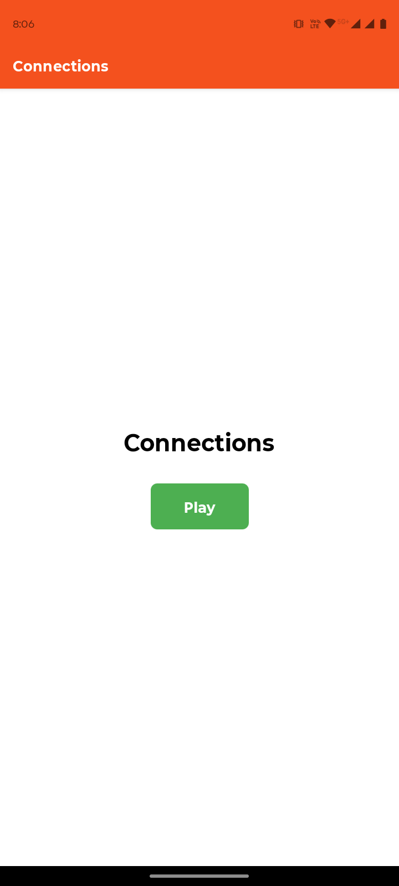
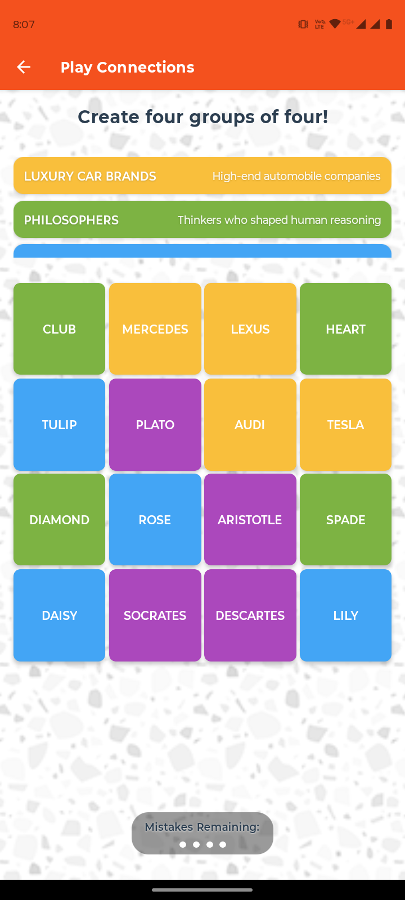
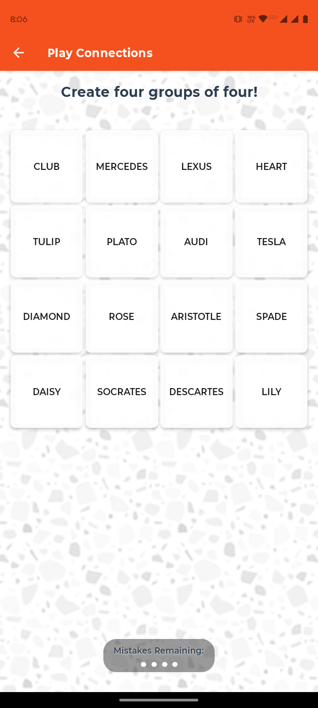

# onlyConnect
A Game of connecting groups

## Screenshots




## Setup Instructions

1. Make sure you have Node.js installed on your system
2. Install Expo CLI globally:
   ```bash
   npm install -g expo-cli
   ```
3. Install project dependencies:
   ```bash
   npm install
   ```

## Running the Project

### Development
To start the development server:
```bash
npm start
```

### Platform Specific
- For iOS simulator:
  ```bash
  npm run ios
  ```
- For Android emulator:
  ```bash
  npm run android
  ```
- For web browser:
  ```bash
  npm run web
  ```

## Project Structure
- `assets/` - Contains images and other static assets
- `screens/` - Contains the app's screen components
- `constants/` - Contains app-wide constants
- `data/` - Contains data files
- `types/` - Contains TypeScript type definitions
- `utils/` - Contains utility functions
- `App.tsx` - Main application component

## Dependencies
- React Native
- Expo
- React Navigation
- TypeScript

## Requirements
- Node.js
- Expo CLI
- iOS Simulator (for iOS development)
- Android Studio (for Android development)
